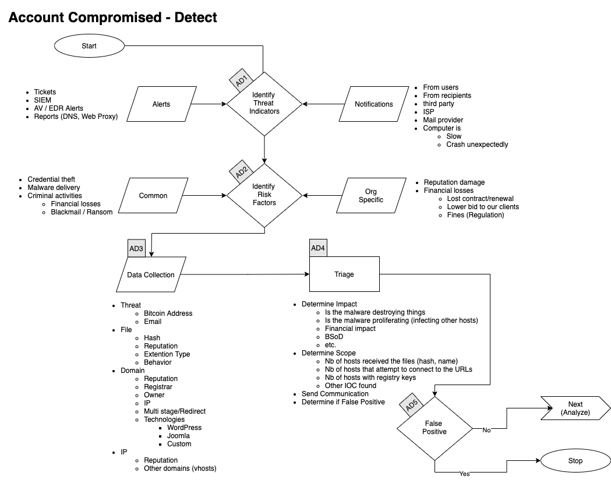
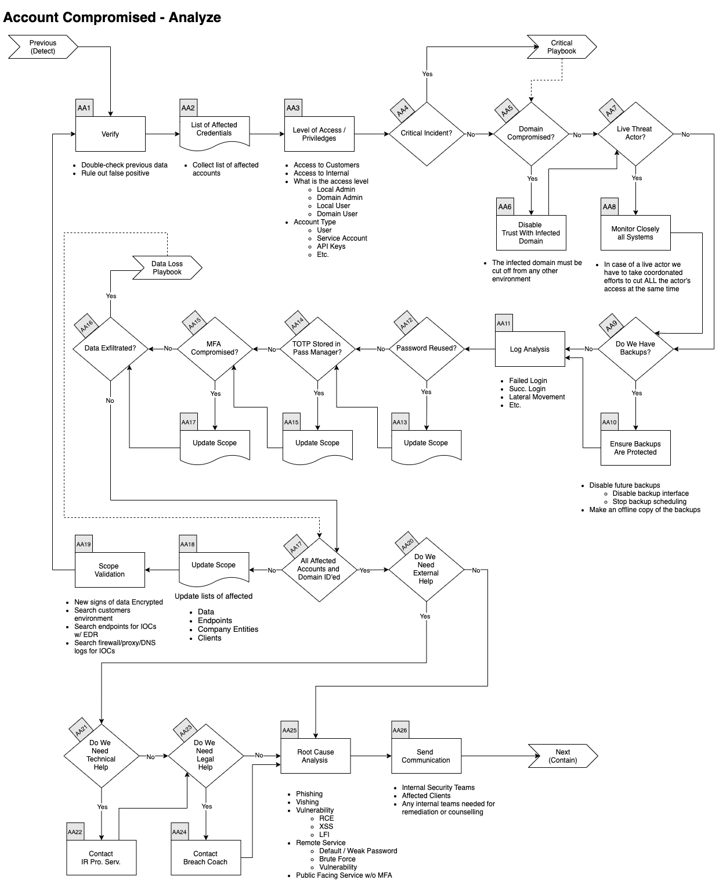
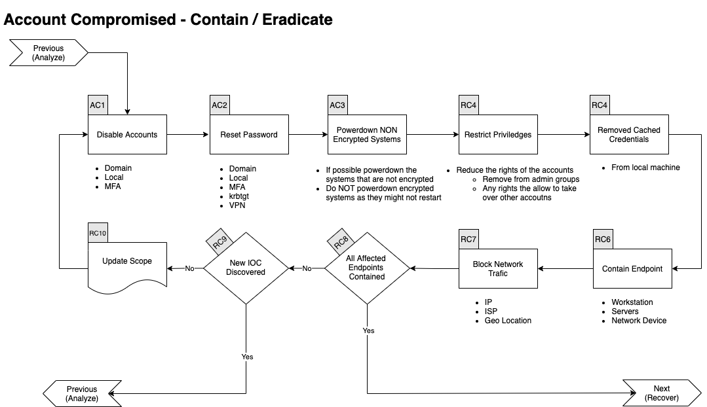
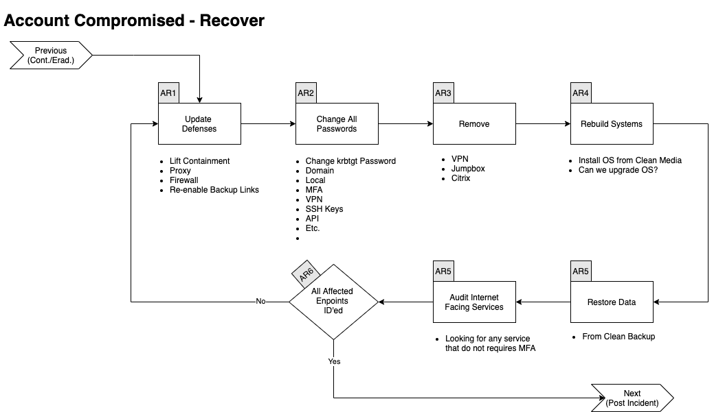

# Account Compromised Playbook

[[_TOC_]]

## Scope
This Playbook covers the steps to take when accounts are compromised.  
Of course, we also need to remediate the hosts where those accounts were used. 

## 1. Preparation

Expand/Colapse

- Create and maintain a list of 
    - all domains owned by Company.
        - This can prevent you from taking actions against our own domains
    - all people of can register domains
- Create email templates 
    - to notify all employees of ongoing phishing campaing against the organization 
    - to contact hosting companies for domain(s) take down
    - to inform 3rd party to take actions against phishing on there infra (Microsoft, Fedex, Apple, etc.)
- Ensure that:
    - Mail anti-malware/anti-spam/anti-phish solutions are in place.
    - Users know how to report phish
    - Detection exists for office documents spawning processes
        - PowerShell
        - CMD
        - WMI
        - MSHTA
        - Etc.
- Perform Firedrill to ensure all aspects of the Playbook are working
    - After publication
    - At least once a year
    - Test/Validate: 
        - [Customer's Cards](Customers)
        - Internal Contact and Escalation Paths
- Review threat intelligence for 
    - threats to the organisation, 
    - brands and the sector, 
    - common patterns 
    - newly developing risks and vulnerabilities
- Ensure  appropriate  access  to  any  necessary  documentation  and  information, including out-of-hours access, for the following
    - IR Playbooks
    - Network Architecture Diagram
    - Dataflow
- Identify and obtain the services of a 3rd party Cyber Forensic provider.
- Define Threat and Risk Indicators and Alerting pattern within the organisation’ssecurity informationand event management (SIEM) solution.

### Train Employees
- Conduct regular awareness campaigns to highlight information security risks faced by employees, including: 
    - Phishing attacks and malicious emails;
    - Ransomware;
    - Reporting a suspected cyber incident.

### Tool Access and Provisioning

#### Tool1
Please referer to [Tool1 Documentation](../Products/TOOL.md)

#### Tool2
Please referer to [Tool2 Documentation](../Products/TOOL.md)

### Assets List
- A list of assets and owner should exists and be available for the following
    - Customers Assets
        - Owners
        - Contacts
        - Pre authorized actions
    - Company Assets (Including all filiale and business units)
        - Onwers
        - Contacts
        - Administrators
        - Pre autorized actions
- Type of assets inventory needed
    - Endpoints
    - Servers
    - Network Equipements
    - Security Appliances
    - Network Ranges
        - Public
        - Private
        - VPN / Out of Band
            - Employees
            - Partners
            - Clients

## 2. Detect

Expand/Colapse

### Workflow

Expand/Colapse

### Identify Threat Indicators

Expand/Colapse

#### Alerts
Alerts are be generated by differents systems owned by the Security/SOC team. The main sources for alerts are  
- Tickets
- SIEM
- Anti-Virus / EDR
- Reports
    - DNS
    - Web Proxy
- Errors from mail servers

#### Notifications
Notifications are comming from external sources usually via email, Teams or phone. The main sources for notifications are  
- Users (internal)
- Recipents of emails (external)
- Third Parties
- ISP
- Mail Providers

### Indentify Risks Factors

Expand/Colapse

#### Common
- Credential Theft
- Malware Delivery
- Criminal Activites
    - Blackmail / Ransom

#### Company Specific
- Financial Losses
    - Lost of conctrat
    - Contract not renewed
    - Lower bid to our clients
    - Fines
        - Regulation

### Data Colletion
This section describe the information that should be collected and documented about the incident  
There is a lot of ressources to help you with that phase [here](../Tools/README.md)

Expand/Colapse

Domains  
- Reputation
- Registrar
- Owner
- IP
- Multistage / Redirect
- Technologies of the site
    - WordPress
    - Joomla
    - Custom Page (credential phish)

IP  
- Reputation
- Owner
- Geo Localisation
- Other domains on that IP

</detials>

### Categorize

Expand/Colapse

Determine type of 

### Triage 

Expand/Colapse

Determine
- Impact
    - Of 
    - Financial
    - Data loss
- Scope (Nb of people)

## 3. Analyze

Expand/Colapse

### Workflow

Expand/Colapse

### AA1. Verify

Expand/Colapse

In conjonction with a senior member of the SOC  
- Double check previous data
- Rule out False Positive

### AA2. List Compromised Credentials

Expand/Colapse

In the Compromised Assets TAB of the Event Log list:   
- Compromised accounts
- Compromised machines
- Compromised domains

### AA3. Level of Access / Priviledges

Expand/Colapse

In conjonction with a senior member of the SOC  
- Double check previous data
- Rule out False Positive

### Update Scope

Expand/Colapse

- Update lists of
    - affected endpoints
    - affected Company Entities
    - affected clients

### Scope Validation

Expand/Colapse

Have all the machines been identified? 
If you find futher traces of phishing or new IOCs go back through this step.  

When you are done identifying all compromised:  
- Hosts

And investigated all:  
- URLs
- Domains
- IP
- Ports
- Files
- Hash

Go to the next phase <Contain/Eradicate>

## 4. Contain / Eradicate

Expand/Colapse

### Workflow

Expand/Colapse

### Block

Expand/Colapse

- Update FW, Proxy, etc. rules
- Blackhole DNS
- Submit to Partners
    - AV/EDR Vendor
    - Web Filter Vendor
    - etc.

### Validate User's Actions

Expand/Colapse

### Malware Infection?

Expand/Colapse

If there was malicious attachments that were openned we need to assume the endpoint(s) was/were infected by a malware.  
Please continue to the [Malware Playbook](../IRP-Malware/README.md)  

### Close Monitoring

Expand/Colapse

- Monitor for 
    - Related incoming messages
    - Internet connections to IOC
    - New files that matches hashes identified

### All Affected Endpoints Contained?

Expand/Colapse

If all affected endpoints have been contained, you can go to the next phase, otherwise continue bellow.  

### New IOC Discovered?

Expand/Colapse

If there was new IOC discovered, go back to the [Analyze Phase](README.md#3-analyze)

## 5. Recover

Expand/Colapse

### Workflow

Expand/Colapse

### Update Defenses

Expand/Colapse

Determine which of the following rules needs to be removed and which needs to stay in the following list:  
- Firewall Rules
- EDR 
    - ban hashes
    - ban domains
    - Containment
- Proxy Block

### All Affected Endpoints Recovered?

Expand/Colapse

If all affected endpoints have been contained, you can go to the next phase, otherwise continue bellow.  

### Validate Countermeasures

Expand/Colapse

Determine if legitimate elements are blocked by:  
- Proxy
- Firewall
- EDR

If so, go back to [Update Defenses](README.md#update-defenses)
Otherwise go to the next phase <Post Incident>

## 6. Post Incident

Expand/Colapse

### Workflow

Expand/Colapse

### Incident Review

Expand/Colapse

- What worked
- What didn't work

### Update Mode of Operations

Expand/Colapse

Update the following documents as requiered:  
- Policies
- Processes
- Procedures
- Playbooks
- Runbooks

Update Detetion Rules in:  
- SIEM
- Anti-Spam
- Malware Gataway
- EDR
- Other security solution

### Review Defensive Posture

Expand/Colapse

- Schedule review of newly introduced rules in6 months
- Are the following still applicatble
    - Firewall Rules
    - Proxy Rules for C2
    - AV / EDR custom Signatures
    - IPS Signatures

### User Awareness Training

Expand/Colapse

# References

This Playbook was built using the following references:  
https://www.dfir.training/index.php?option=com_jreviews&format=ajax&url=media/download&m=14tt1&1600804844570  
https://www.gov.scot/publications/cyber-resilience-incident-management/  
https://github.com/certsocietegenerale/IRM/tree/master/EN  
https://www.incidentresponse.com/playbooks/  
https://ayehu.com/cyber-security-incident-response-automation/top-5-cyber-security-incident-response-playbooks/  
https://nvlpubs.nist.gov/nistpubs/SpecialPublications/NIST.SP.800-61r2.pdf  
