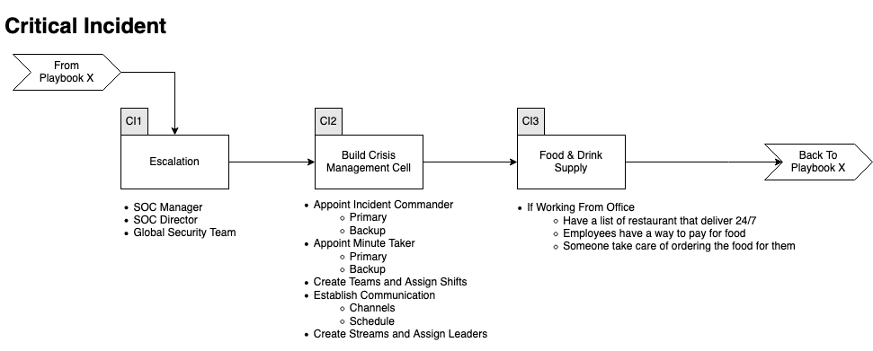

# Critical Incident Playbook
Here are the steps to take when an incident is deemed critical.   
The fact that the incident is critical doesn't mean the Playbook can/should be ignored. It just means that every steps needs to occur faster, that more people will be working on the incident and that an Incident Commander will be appointed. 

[[_TOC_]]

## Workflow

Expand/Colapse

## CI1 - Build a Crisis Management Cell

Expand/Colapse

The SOC Manager and Director will
- Appoint an Incident Commander and a backup
    - Responsable to call the shots
    - Ensuring the Playbooks are followed
        - No steps are forgotten
        - Steps are taken in the right order
            - This doesn't mean many steps cannot be taken simultaniously
        - Chain of Custody is maintain
    - There's always someone taking notes
    - Key person to gather all information
    - Can autorize actions
        - Disconnect MPLS
        - Shutdown services/computer
    - Can autorize spending
        - Equipement
        - VM
            - GCP
            - AWS
            - Digital Ocean
        -  Software 
- Appoint an "minute taker" and a backup
- Create 
    - Alpha Team
    - Beta Team
    - Charlie Team
- Establish communication schedule
    - Stream Report
    - C Level communication
    - etc.

The goal of these teams is to 
- Have people around the clock working on the incident
- Allow people to rest
- Have period of time for pass over
    - At least 1 hour (2 prefered)
    - Both Teams are working togther 
    - All updates are given

Each of the teams need to 
- Have Stream Leads
    - Log review Stream
        - Depth and Breath of the attack
    - Vulnerability Assement
        - To try and identify root cause
        - See if any other systems have the same Vulnerability
    - Forensics Stream
        - Understand what happend on the host(s)
        - Malware analysis
        - Identify IOC
        - Feed the Log Stream
    - Host Stream
        - Deploy security solution
        - Update security solution
        - Build new server
        - Install apps
        - Restore data
        - etc.
    - Dark Web / Social Media monitoring Stream (optional)
        - Is there any chatter about the breach
        - Is the data for sale
        - Is the data posted somewhere

## CI2 - Food & Drink Supply
If working from the office we need to know how we will feed our staff.  
Someone will need to have a list of restaurants that deliver 24/7 to our locations.  
We don't want our team to eat fried chicken or pizza 3 times a day.

## CI3 - Define Communication Schedule
During a critical incident information sharing is critical.  
We need to ensure everyone knows where and when to report information. 

Define the following
- Who will attend each calls
- What platform will be used to communicate
- Technical call to sync information between the Streams
- C-Level information call
- Customers information call

## CI4 - Return to the Playbook
Once the roles and teams have been formed, send the team that will take over away so they can rest and be ready to take over.  
Finally return to the original(s) Playbook(s)

Good luck!
 
