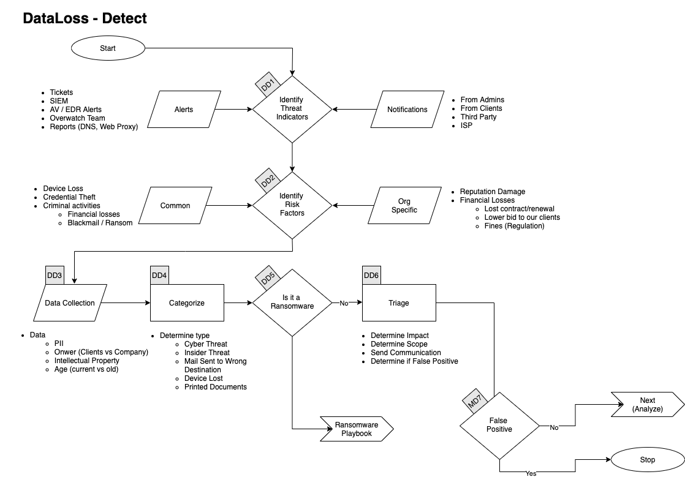
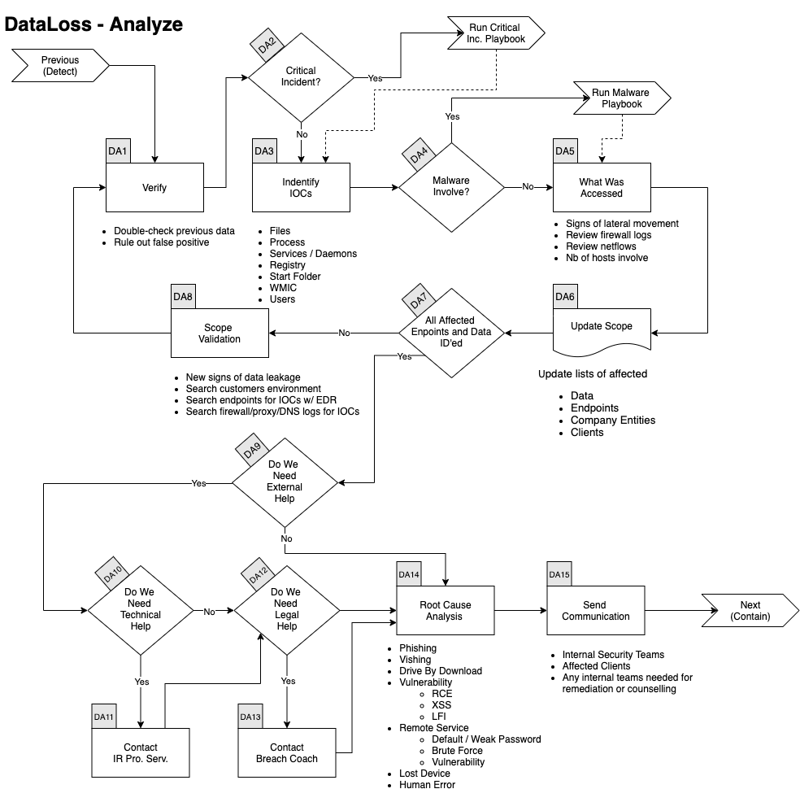
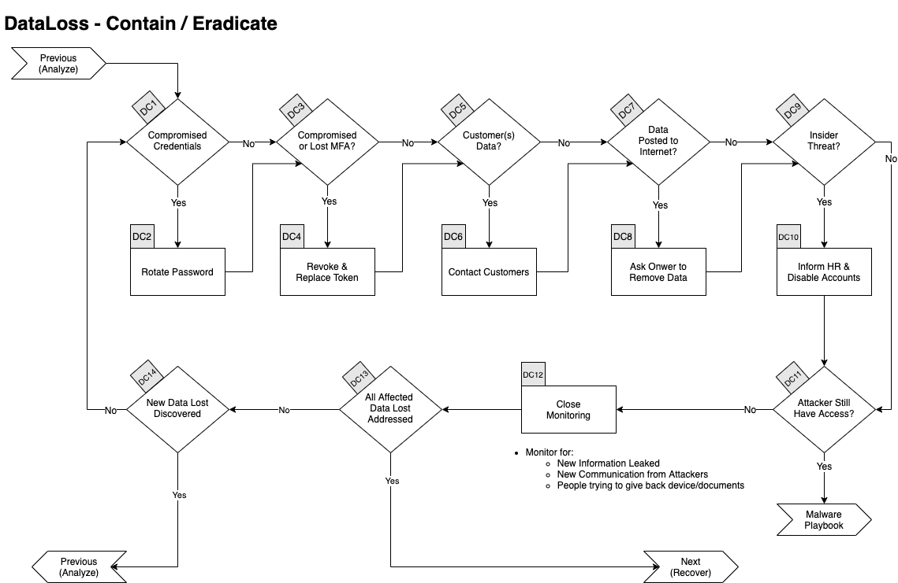
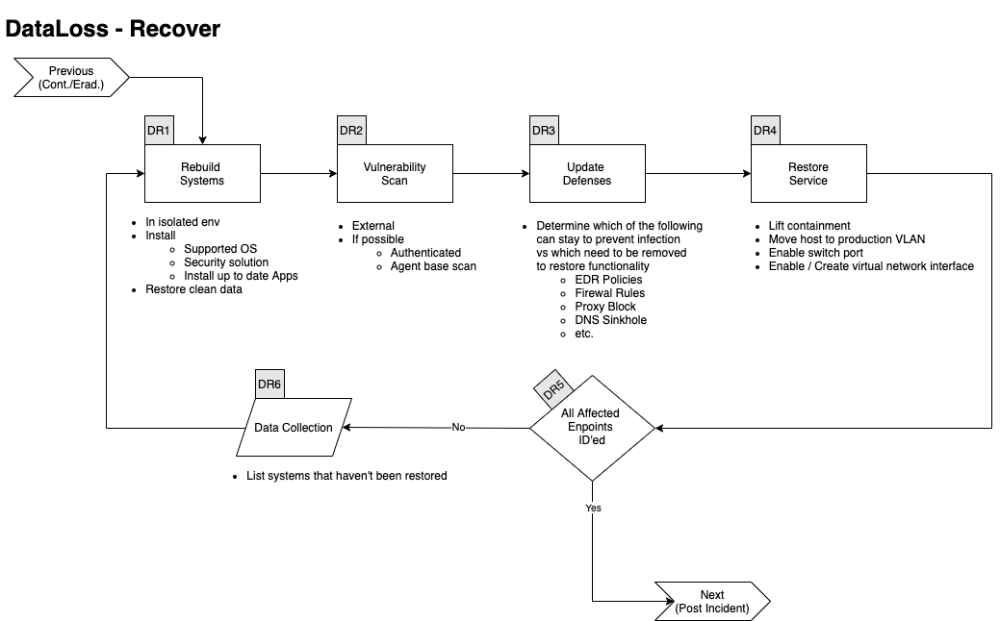

# Data Loss Playbook

[[_TOC_]]

## Scope
This Playbook covers the steps to take in case of Data Loss / Data Breach.

## 1. Preparation

Expand/Colapse

- Create and maintain a list of 
    - all domains owned by Company.
        - This can prevent you from taking actions against our own domains
    - all people of can register domains
- Create email template 
    - to notify all employees of ongoing phishing campaing against the organization 
    - to contact hosting companies for domain take down
    - to inform 3rd party to take actions against phishing on there infra (Microsoft, Fedex, Apple, etc.)
- Ensure that:
    - Mail anti-malware/anti-spam/anti-phish solutions are in place.
    - Users know how to report phish
    - Detection exists for office documents spawning processes
        - PowerShell
        - CMD
        - WMI
        - MSHTA
        - Etc.
- Perform Firedrill to ensure all aspects of the Playbook are working
    - After publication
    - At least once a year
    - Test/Validate: 
        - [Customer's Cards](Customers)
        - Internal Contact and Escalation Paths
- Review threat intelligence for 
    - threats to the organisation, 
    - brands and the sector, 
    - common patterns 
    - newly developing risks and vulnerabilities
- Ensure  appropriate  access  to  any  necessary  documentation  and  information, including out-of-hours access, for the following
    - IR Playbgns to highlight information security risks faced by employees, including: 
    - Phishing attacks and malicious emails;
    - Ransomware;
    - Reporting a suspected cyber incident.

### Tool Access and Provisioning

#### Tool1
Please referer to [Tool1 Documentation](../Products/TOOL.md)

#### Tool2
Please referer to [Tool2 Documentation](../Products/TOOL.md)

### Assets List
- A list of assets and owner should exists and be available for the following
    - Customers Assets
        - Owners
        - Contacts
        - Pre authorized actions
    - Company Assets (Including all filiale and business units)
        - Owners
        - Contacts
        - Administrators
        - Pre autorized actions
- Type of assets inventory needed
    - Endpoints
    - Servers
    - Network Equipements
    - Security Appliances
    - Network Ranges
        - Public
        - Private
        - VPN / Out of Band
            - Employees
            - Partners
            - Clients

## 2. Detect

Expand/Colapse

### Workflow

Expand/Colapse

### DD1. Identify Threat Indicators

Expand/Colapse

#### Alerts
Alerts are be generated by differents systems owned by the Security/SOC team. The main sources for alerts are  
- Tickets
- SIEM
- Anti-Virus / EDR
- Reports
    - DNS
    - Web Proxy

#### Notifications
Notifications are comming from external sources usually via email, Teams or phone. The main sources for notifications are  
- System Administrators
- Clients
- Third Parties
- ISP

### DD2. Indentify Risks Factors

Expand/Colapse

#### Common
- Credential Theft
- Device Loss
    - Laptop
    - Phone
- Criminal Activites
    - Blackmail / Ransom

#### Company Specific
- Reputation Damage
- Financial Losses
    - Lost of conctrat
    - Contract not renewed
    - Lower bid to our clients
    - Fines
        - Regulation

### DD3. Data Colletion
This section describe the information that should be collected and documented about the incident  
There is a lot of ressources to help you with that phase [here](../Tools/README.md)

Expand/Colapse

Type Data
- Personally identifiable information (PII) 
- Intellectual Property
- Age of the Data 
    - Current
    - Old
- Owner of the Data
    - Company
    - Clients

### DD4. Categorize

Expand/Colapse

Determine type of Data Loss we are dealing with.
- Cyber Threat
- Insider Threat
- Mail Sent to Wrong Destination
- Device Lost
    - Laptop
    - Phone
- Printed Documents

### DD5. Is it Ransomware ?

If the Data Loss is caused by a Ransomware please refere to the   

### DD6. Triage 

Expand/Colapse

- Determine Impact
- Determine Scope 
    - Number of Documents / Records
    - Number of Clients
    - Number of Company Entities
    - Number of Individuals
- Send Communincation
- Determine if False Positive

## 3. Analyze

Expand/Colapse

### Workflow

Expand/Colapse

### DA1. Verify

Expand/Colapse

In conjonction with a senior member of the SOC  
- Double check previous data
- Rule Out False Positive

### DA2. Critical Incident
If this incident is deemed **Major or Critical** by the senior analyst go to the [Critical Incident Playbook](../IRP-Critical/)

### DA3. Identify IOCs

Expand/Colapse

- Data
    - All Files Lost
    - Records Stolen
    - MFA Token
    - Credentials
    - PII
- Validate hashes
    - [VirusTotal](../Tools/README.md#virus-total)
    - [Hybrid Analysis](Tools/README.md#hybrid-analysis)
- Validate links
    - [VirusTotal](../Tools/README.md#virus-total)
    - [Hybrid Analysis](../Tools/README.md#hybrid-analysis)
    - [URLScan](../Tools/README.md#urlscan)
- ID other addresses, domains, IPs
    - [VirusTotal](../Tools/README.md#virus-total)
    - [Hybrid Analysis](../Tools/README.md#hybrid-analysis)
    - [Talos Intelligence](../Tools/README.md#hybrid-analysis)
- Search Threat Intel sources
    - [VirusTotal](../Tools/README.md#virus-total)
    - [Hybrid Analysis](../Tools/README.md#hybrid-analysis)
    - [Talos Intelligence](../Tools/README.md#hybrid-analysis)
- Disk forensics on recipient's endpoint

### DA4. Malware
If **Malware** was involve in the incident refer to the [Malware Playbook](../IRP-Malware/)  

### DA5. What Was Accessed

Expand/Colapse

Did the attack touched other systems?  
Look for:  
- Signs of Lateral Movement
- Review Firewall Logs
- Review Netflows
- Assess the Number of Hosts Involved
- Number of Clients Affected
    - Perform the same research for all affected clients

### DA6. Update Scope

Expand/Colapse

- Update lists of affeected
    - Data
    - Endpoints
    - Company Entities
    - Clients

### DA8. Scope Validation

Expand/Colapse

Have all the machines and data been identified? 
If you find futher traces of phishing or new IOCs go back to [Verify Step](README.md#verify).  

When you are done identifying all :  
- Data that was Lost
- Affected Endpoints
- Affected Company Entities
- Affected Customers

And if applicable investigated all:  
- URLs
- Domains
- IP
- Ports
- Files
- Hash

You can proceed with the next steps.  

### DA9. External Help
Does Company have all the knowledge and ressources to handle the crisis alone?

#### DA11. Technical Help
If the Incident Commander feels we need Technical help or ressources to handle the incident he can reach out to our Incident Response Partner.  
We have a retainer with the following company and we can reach them at : xxxx@yyy.com or 555-555-5555

#### DA12. Legal Help
If there are Legal implication such as
- GDPR
- Criminal Charges
- Regulation
- Laws

### DA14. Root Cause Analysis

Expand/Colapse

Identify how this incident happened. 
- Phishing Emails
- Voice Phishing
- Drive-by Download
- Vulnerability
    - Remote Code Execution
    - Cross-Site Scripting
- Remote Services
    - Default / Weak Password
    - Brute Force
    - Vulnerability
- Lost Device
- Human Error

### DA15. Send Communincation

Expand/Colapse

Contact any relevant of the following party
- Internal Security Team
- Affected Clients
- Any internal teams needed for remediation or counselling 

## 4. Contain / Eradicate

Expand/Colapse

### Workflow

Expand/Colapse

### DC1. Compromised Credentials

Expand/Colapse

If any credentials are suspected to have been accessed, stolen or used they will all need to be changed.  
This applies to:  
- Local Passwords
- Network Passwords
- Remote Passwords
- Etc.

### DC3. Compromised or Lost MFA

Expand/Colapse

If any Multi Factor Authentication token/code were accessed, stolen or used they will all need to be 
- Revoke
- Replace.  

### DC5. Customer Data

Expand/Colapse

If any if customer data was accessed or leaked we will need to send communication to all affected clients using the approved [Customer Communication Template]().  

### DC7. Data Posted to the Internet

Expand/Colapse

If the site is controlled by an public company, we can ask them to remove the information. Usually writing at <abuse@company.com> is a good place to start.

### DC9. Insider Threat

Expand/Colapse

If the information was intentionally leaked/sold by an employee, we need to:  
- Contact HR
- Disable User Account
- Disable any MFA token

We will potentially need to send physical security to the employee's desk to seize his/her laptop and other devices. 

### DC11. Attacker Still Have Access?

If there is any sign of the attacker still being in the network, go to the [Malware Playbook](../IRP-Malware/README.md)  

### DC12. Close Monitoring

Expand/Colapse

- Monitor for 
    - New information leaked
    - New communication from Attackers
    - People trying to give back device(s)/document(s)

### DC13. All Affected Data Lost Addressed?

Expand/Colapse

If all affected data have been addressed, you can go to the [Recover phase](README.md#5-recover), otherwise continue bellow.  

### DC14. New Data Lost Discovered?

Expand/Colapse

If there was new leaked data/devices discovered, go back to the [Analyze Phase](README.md#3-analyze)

## 5. Recover

Expand/Colapse

### Workflow

Expand/Colapse

### DR1. Rebuilt Systems

Expand/Colapse

In an isolated environment:  
    - Install 
        - Supported OS
        - Security solutions
        - Up to date applications
    - Restore data (from a clean backup)

### DR2. Vulnerability Scan

Expand/Colapse

Perform:  
- External VA
- If possible
    - Authenticated scan
    - Agent base scan

### DR3. Update Defenses

Expand/Colapse

Determine which of the following rules needs to be removed and which needs to stay in the following list:  
- Firewall Rules
- EDR 
    - Ban hashes
    - Ban domains
    - Containment
- Proxy Block
- DNS Sinkhole
- Etc. 

### DR4. Restore Service

Expand/Colapse

Depending on the containment applied to the host, perform all the following that applies:  
- Lift containment in EDR console
- Move host to production VLAN
- Enable switch port
- Enable/Create virtual network interface
- etc. 

### DR5. All Affected Endpoints Restored?

Expand/Colapse

If all affected endpoints have been restored, you can go to the [Post Incident](README.md#6.-post-incident) phase, otherwise continue bellow.  
- List systems that haven't been restored
- Go to [README.md#rebuild-systems]

## 6. Post Incident

Expand/Colapse

### Workflow

Expand/Colapse

### DP1. Incident Review

Expand/Colapse

- What worked
- What didn't work

### DP2. Update Mode of Operations

Expand/Colapse

Update the following documents as requiered:  
- Policies
- Processes
- Procedures
- Playbooks
- Runbooks

Update Detetion Rules in:  
- SIEM
- Anti-Spam
- Malware Gataway
- EDR
- Other security solution

### DP3. Review Defensive Posture

Expand/Colapse

- Schedule review of newly introduced rules in6 months
- Are the following still applicatble
    - Firewall Rules
    - Proxy Rules for C2
    - AV / EDR custom Signatures
    - IPS Signatures

### DP4. Build New Detection

Expand/Colapse

If the Data Loss was not caused by a lost device, we need to build new detections
- Mail Service
- Anti-Spam / Anti-Phish
- ATT&CK Techniques
- etc. 

### DP5. Modifify Base Images

Expand/Colapse

If the Data Loss was caused by a lack of hardening or sufficient patch level: 
- Review hardening processes
- Include critical patches in base Images
- etc. 

### DP7. User Awareness Training

Expand/Colapse

If the incident was caused by a human error
- Create / Select new mandatory training
    - Cyber Education Vendor
    - From Youtube videos
    - Built by internal teams

### DP8. Calculate Incident's Cost

Expand/Colapse

Calculate the incident's Cost
- Time Spent
- Ransom paid
- Downtime
- Fines / Penalities
- etc. 

# References

This Playbook was built using the following references:  
https://www.dfir.training/index.php?option=com_jreviews&format=ajax&url=media/download&m=14tt1&1600804844570  
https://www.gov.scot/publications/cyber-resilience-incident-management/  
https://github.com/certsocietegenerale/IRM/tree/master/EN  
https://www.incidentresponse.com/playbooks/  
https://ayehu.com/cyber-security-incident-response-automation/top-5-cyber-security-incident-response-playbooks/  
https://nvlpubs.nist.gov/nistpubs/SpecialPublications/NIST.SP.800-61r2.pdf  
