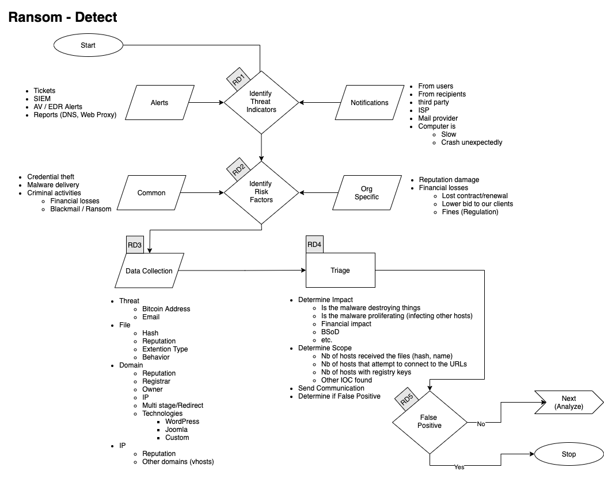
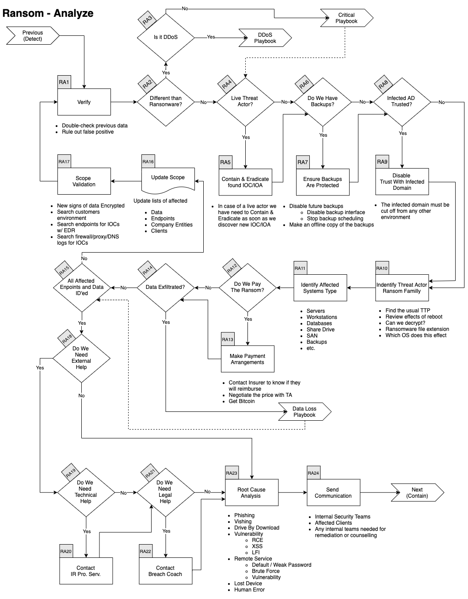
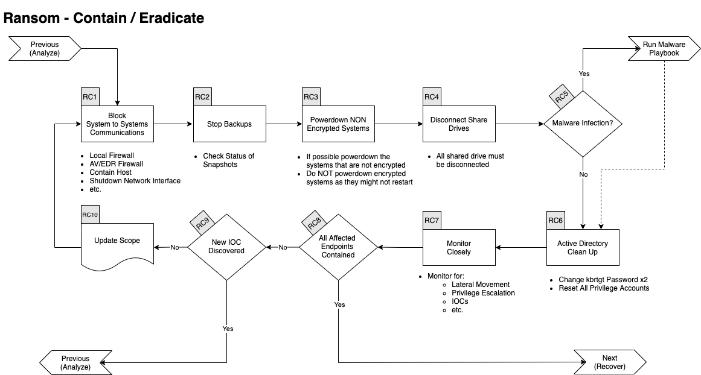
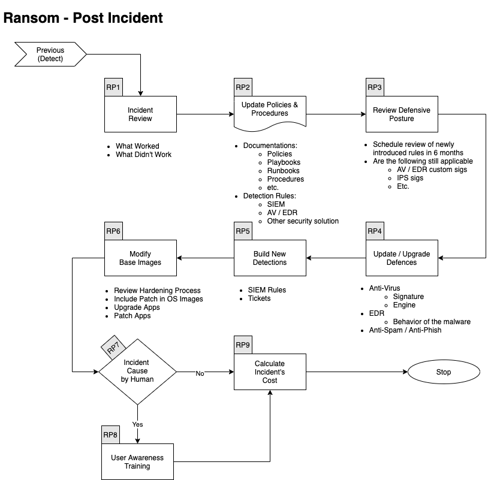

# Ransom Playbook

[[_TOC_]]

## Scope
This Playbook covers various type of Ransom we could be faced with. The most common being Ransomware but we try to also account for other types.  
It was built to be run in parallele with the [Malware Playbook](../IRP-Malware/) and possibly the [Critical Playbook](../IRP-Critical/)

## 1. Preparation

Expand/Colapse

- Create and maintain a list of 
    - all domains owned by Company.
        - This can prevent you from taking actions against our own domains
    - all people of can register domains
- Create email template 
    - to notify all employees of ongoing phishing campaing against the organization 
    - to contact hosting companies for domain take down
    - to inform 3rd party to take actions against phishing on there infra (Microsoft, Fedex, Apple, etc.)
- Ensure that:
    - Mail anti-malware/anti-spam/anti-phish solutions are in place.
    - Users know how to report phish
    - Detection exists for office documents spawning processes
        - PowerShell
        - CMD
        - WMI
        - MSHTA
        - Etc.
- Perform Firedrill to ensure all aspects of the Playbook are working
    - After publication
    - At least once a year
    - Test/Validate: 
        - [Customer's Cards](Customers)
        - Internal Contact and Escalation Paths
- Review threat intelligence for 
    - threats to the organisation, 
    - brands and the sector, 
    - common patterns 
    - newly developing risks and vulnerabilities
- Ensure  appropriate  access  to  any  necessary  documentation  and  information, including out-of-hours access, for the following
    - IR Playbgns to highlight information security risks faced by employees, including: 
    - Phishing attacks and malicious emails;
    - Ransomware;
    - Reporting a suspected cyber incident.

### Tool Access and Provisioning

#### Tool1
Please referer to [Tool1 Documentation](../Products/TOOL.md)

#### Tool2
Please referer to [Tool2 Documentation](../Products/TOOL.md)

### Assets List
- A list of assets and owner should exists and be available for the following
    - Customers Assets
        - Owners
        - Contacts
        - Pre authorized actions
    - Company Assets (Including all filiale and business units)
        - Owners
        - Contacts
        - Administrators
        - Pre autorized actions
- Type of assets inventory needed
    - Endpoints
    - Servers
    - Network Equipements
    - Security Appliances
    - Network Ranges
        - Public
        - Private
        - VPN / Out of Band
            - Employees
            - Partners
            - Clients

## 2. Detect

Expand/Colapse

### Workflow

Expand/Colapse

### RD1. Identify Threat Indicators

Expand/Colapse

#### Alerts
Alerts are be generated by differents systems owned by the Security/SOC team. The main sources for alerts are  
- Tickets
- SIEM
- Anti-Virus / EDR
- Reports
    - DNS
    - Web Proxy
- Errors from mail servers

#### Notifications
Notifications are comming from external sources usually via email, Teams or phone. The main sources for notifications are  
- Users (internal)
- Recipents of emails (external)
- Third Parties
- ISP
- Mail Providers

### RD2. Indentify Risks Factors

Expand/Colapse

#### Common
- Credential Theft
- Malware Delivery
- Criminal Activites
    - Blackmail / Ransom

#### Company Specific
- Financial Losses
    - Lost of conctrat
    - Contract not renewed
    - Lower bid to our clients
    - Fines
        - Regulation

### RD3. Data Colletion
This section describe the information that should be collected and documented about the incident  
There is a lot of ressources to help you with that phase [here](../Tools/README.md)

Expand/Colapse

Domains  
- Reputation
- Registrar
- Owner
- IP
- Multistage / Redirect
- Technologies of the site
    - WordPress
    - Joomla
    - Custom Page (credential phish)

IP  
- Reputation
- Owner
- Geo Localisation
- Other domains on that IP

</detials>

### Categorize

Expand/Colapse

Determine type of 

### RD4. Triage 

Expand/Colapse

Determine
- Impact
    - Of 
    - Financial
    - Data loss
- Scope (Nb of people)

## 3. Analyze

Expand/Colapse

### Workflow

Expand/Colapse

### RA1. Verify

Expand/Colapse

In conjonction with a senior member of the SOC  
- Double check previous data
- Rule out False Positive

### RA2. Identify type of Ransom

Expand/Colapse

The first thing we need to do is understand which type of Ransom we are dealing with.
- Is this a Ransomware?
- Is this a DDoS related Ransom? 
    - For now, we do not have a DDoS Playbook, so referer to the [Critical Playbook](../IRP-Critical/)

If it's another type, you should follow the [Critical Playbook](../IRP-Critical/) and escalate to the SOC and/or Security management.

### RA4. Assess if the Threat Actor is still in the Network

Expand/Colapse

Depending if the actor has succesfully encrypted the data or if they are still actively trying, the speed at which we must act is different.  
If the actor is still in the network, the containment effort needs to be taken as fast as possible and the Contain & Eradicate actions will be intertwined with the Analysis. 

### RA6. Do We Have Backup?

Expand/Colapse

If we have backups, we must make sure they are protected and not overriten. Here's some of the steps that needs to be taken:
- Disable future backups
    - Disable backup Interface
    - Stop backup scheduling
- Make an offline copy of the backup

### RA8. Is the infected environment (AD) trusted by other environment?

Expand/Colapse

In order to provent the adversaries to reach other domains that could be linked, we need to 
- Disable any Trust from that domain to others
- In some cases, we might need to disconnect the MPLS Link
    - This needs management approval (refer to the [Critical Playbook](../IRP-Critical/))

### RA10. Identify Threat Actor/Ransomware Familly

Expand/Colapse

Using the various artefacts, we need to identify who our adversary is. This will help
- Know the TTP they typically use
- Potentially indetify the Initial Access technique
- Understand how they move laterally
    - WMI
    - PSExec
    - RDP
    - Etc.
- Understand the effect of a reboot on the machine
- Is there a known decryptor
    - This is increasingly less frequent
- Which OS version are targeted

Things that we can use to identify the adversary: 
- Ransomware note
- Malware payload
- Encrypted file extentions
- Email / Web portal
- Bitcoin addresses
- etc.

### RA11. Identify Affected Systems Type

Expand/Colapse

In order to remediate properly and engage the right team(s) we need to understand which type of systems were affected: 
- Servers
    - OS version
    - Kernel
- Workstations
    - OS version
    - Service Pack
- Databases
- Share Drives
- SAN
- Backups
- Etc.

### RA12. Do We Pay the Ransom?

Expand/Colapse

Depending on the state of the backups, the type of devices that was encrypted, we might need to pay the ransom.  
**NOTE**: This decision must be taken by the Board (or the client(s)), but we are here to help advice.  

Here a some things think about if we decide to pay:
- Will the insurer cover/reimbourse?
- Most of threat actors are open to negociation and we should **always** negociate the price down
- We need to get Bitcoin on a trusted exchange

### RA14. Was Data Exfiltrated?

Expand/Colapse

If data was exfiltrated we need to refer to the the [Data Loss Playbook](../IRP-DataLoss/) 

### RA15. Were All Endpoints and Data Identified?

Expand/Colapse

If we have found new affected endpoints or data go to the next section. 

If we have identified all endpoints and data you can jump to [Do we need external help](README.md#ra18-external-help)
- Update FW, IDS, etc. rules w/ IOCs
- Search endpoints for IOCs w/ EDR

### RA16. Update Scope

Expand/Colapse

- Update lists of
    - affected endpoints
    - affected Company Entities
    - affected clients

### RA17. Scope Validation

Expand/Colapse

Have all the machines been identified? 
If you find futher traces of phishing or new IOCs go back through this step.  

When you are done identifying all compromised:  
- Hosts
- Data

You can continue to the next phase. 

### RA18. External Help

Expand/Colapse

Does Company have all the knowledge and ressources to handle the crisis alone?

#### RA19. Technical Help

Expand/Colapse

The Incident Commander can reach out to a 3rd Party Incident Responder
- xxxx@yyyy.com
- 555-555-1212 

#### RA21. Legal Help

Expand/Colapse

If there are Legal implication such as
- GDPR
- Criminal Charges
- Regulation
- Laws

The Incident Commander can reach out to a Breach Coach / Cyber Insurer
- aaa@bbb.com
- 555-555-1212

### RA23. Root Cause Analysis

Expand/Colapse

Identify how this incident happened. 
- Phishing Emails
- Voice Phishing
- Drive-by Download
- Vulnerability
    - Remote Code Execution
    - Cross-Site Scripting
- Remote Services
    - Default / Weak Password
    - Brute Force
    - Vulnerability
- Lost Device
- Human Error

### RA24. Send Communincation

Expand/Colapse

Contact any relevant of the following party
- Internal Security Team
- Affected Clients
- Any internal teams needed for remediation or counselling 

## 4. Contain / Eradicate

Expand/Colapse

### Workflow

Expand/Colapse

### RC1. Block Systems to Systems Communincations

Expand/Colapse

The first things we need to do with ransomware is to block systems to systems communincation. We can do this using various methods such as: 
- EDR containment fonction
- Local Firewall
    - This could be circonvented if the adversary is still on the system
- AV/EDR Firewall
- Shutdown Network Interface
    - This mostly apply to VM
- Disable the switch port on the router
- Etc. 

### RC2. Stop Backups

Expand/Colapse

- Check status of Snapshots

### RC3. Powerdown NON Encrypted Systems

Expand/Colapse

- If possible powerdown the systems that are not encrypted
- Do NOT powerdown encrypted systems as they might not restart

### RC4. Disconnect Share Drives

Expand/Colapse

- All shared drive must be disconnected

### RC5. Malware Infection

Expand/Colapse

- If there is a Malware infection run the [Malware Playbook](../IRP-Malware/README.md)

### RC6. Active Directory Clean Up

Expand/Colapse

In most cases these actions should be sufficient:
- Change kbrtgt Password twice
- Reset All Privilege Accounts

In cases where we beleive Domain Admin account(s) were compromised we have to do the following **before** the steps above: 
- Restore the AD from backup that predate the initial compromised
- If no backup exists:
    - Consider rebuiling the AD from scratch. 
    - Change how we protect sensitive Accounts

The decision to rebuilt from strach should come from the higher management of the Global-Security Team or of the client's security team.

### RC7. Monitor Closely

Expand/Colapse

- Monitor for:
    - Lateral Movement
    - Privilege Escalation
    - IOCs
    - etc.

### RC9. New IOC Discovered

Expand/Colapse

- Go back to [Ransom Analyze](../IRP-Ransom/README.md#3-analyze)

## 5. Recover

Expand/Colapse

### Workflow

Expand/Colapse

### RR1. Update Defenses

Expand/Colapse

Determine which of the following actions need to be performed:  
- Lift Containment
- Proxy Block
- Firewall Rules
- Reconnect Shared Drives
- Re-enable Backup Links
- Enable Network Interfaces
- Update EDR/AV
    - Engine
    - Policies
    - Definitions

### RR2. Change All Passwords

Expand/Colapse

- Change krbtgt Password
- Reset All Priviledge Accounts

### RR3. Remove

Expand/Colapse

- VPN
- Jumpbox
- Citrix

### RR4. Rebuild Systems

Expand/Colapse

- Install OS from Clean Media
- Can we upgrade OS?

### RR5. Restore Data

Expand/Colapse

- Use a clean backup

## 6. Post Incident

Expand/Colapse

### Workflow

Expand/Colapse

### RP1. Incident Review

Expand/Colapse

- What worked
- What didn't work

### RP2. Update Mode of Operations

Expand/Colapse

Update the following documents as requiered:  
- Policies
- Processes
- Procedures
- Playbooks
- Runbooks

Update Detetion Rules in:  
- SIEM
- Anti-Spam
- Malware Gataway
- EDR
- Other security solution

### RP3. Review Defensive Posture

Expand/Colapse

- Schedule review of newly introduced rules in6 months
- Are the following still applicatble
    - Firewall Rules
    - Proxy Rules for C2
    - AV / EDR custom Signatures
    - IPS Signatures

### RP4. Update & Upgrade Defenses

Expand/Colapse

Various security solutions might need to be updated or upgraded to prevent a similar incident from occuring again.

Here are a few items to consider:
- Anti-Virus
    - Signatures
    - Engine
- EDR
    - Behaviour (TTP)
    - Custom Detection
- Anti-Spam 
    - Filter
- Anti-Phishing

### RP5. Build New Detection

Expand/Colapse

If the incident was detected late in the Kill Chain, we need to try to improve our detection to catch a similar incident earlier.

We could for instance: 
- Create SIEM rules
- Generate SNOW tickets
- Create Miro Plays 
- etc. 

### RP6. Modifify Base Images

Expand/Colapse

If the Ransom was caused by a lack of hardening or sufficient patch level: 
- Review hardening processes
- Include critical patches in base Images
- etc. 

### RP7. User Awareness Training

Expand/Colapse

If the incident was caused by a human error
- Create / Select new mandatory training
    - From Security Education Vendor
    - From Youtube video
    - Built by internal teams

### RP9. Calculate Incident's Cost

Expand/Colapse

Calculate the incident's Cost
- Time Spent
- Ransom paid
- Downtime
- Fines / Penalities
- etc. 

# References

This Playbook was built using the following references:  
https://www.dfir.training/index.php?option=com_jreviews&format=ajax&url=media/download&m=14tt1&1600804844570  
https://www.gov.scot/publications/cyber-resilience-incident-management/  
https://github.com/certsocietegenerale/IRM/tree/master/EN  
https://www.incidentresponse.com/playbooks/  
https://ayehu.com/cyber-security-incident-response-automation/top-5-cyber-security-incident-response-playbooks/  
https://nvlpubs.nist.gov/nistpubs/SpecialPublications/NIST.SP.800-61r2.pdf  
